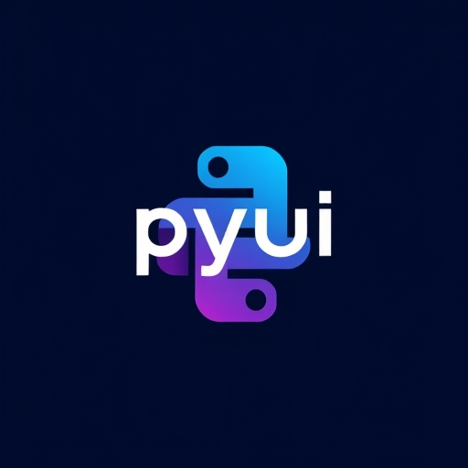

<h1>PYUI-LiveCompiler</h1>

You create application with Qt/PyQt/Qt Designer, this tool with easy your work  
It keeps your py files derivied from ui files update on every modifications you add to the ui.

## Requierments ⚓

You should have

- Install pyqt6 in your environement
- Make sure pyuic6 is avalaible into your path

## Features 📦

- UI files live compilation into py ones

